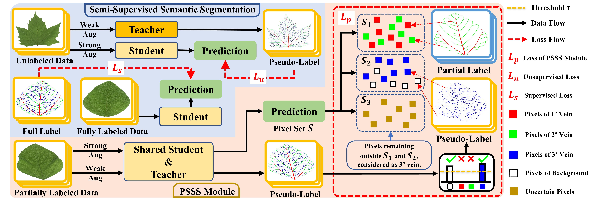
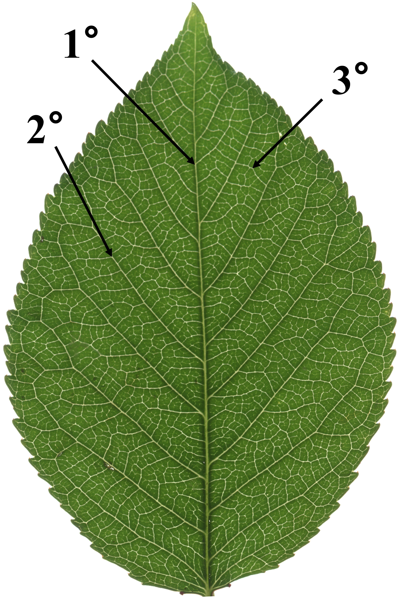
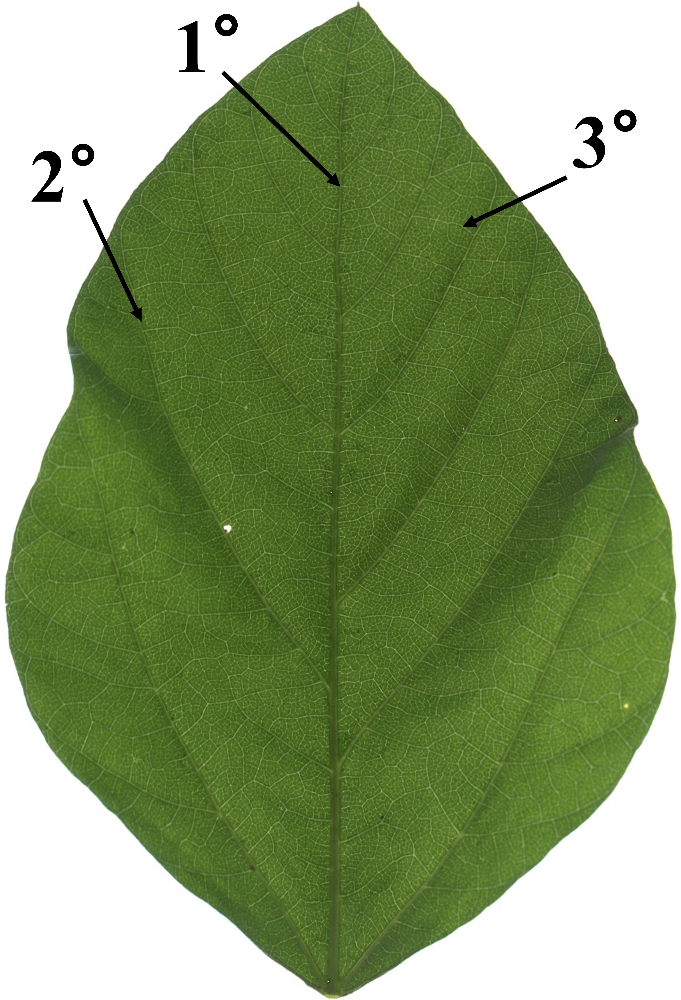

# Revealing Hierarchical Structure of Leaf Venations in Plant Science via Label-Efficient Segmentation: Dataset and Method

 
 
 
 

This repository contains the code and dataset for the paper "Revealing Hierarchical Structure of Leaf Venations in Plant Science via Label-Efficient Segmentation: Dataset and Method," accepted at **IJCAI2024** in the AI and Social Good track.

[Weizhen Liu1](https://www.researchgate.net/profile/Weizhen-Liu), [Ao Li1](https://arxiv.org/search/cs?searchtype=author&query=Li,+A), [Ze Wu1](https://arxiv.org/search/cs?searchtype=author&query=Wu,+Z), [Yue Li1](https://arxiv.org/search/cs?searchtype=author&query=Li,+Y), [Baobin Ge1](https://arxiv.org/search/cs?searchtype=author&query=Ge,+B), [Guangyu Lan1](https://arxiv.org/search/cs?searchtype=author&query=Lan,+G), [Shilin Chen1](https://arxiv.org/search/cs?searchtype=author&query=Chen,+S), [Minghe Li2](https://arxiv.org/search/cs?searchtype=author&query=Li,+M), [Yunfei Liu1](https://arxiv.org/search/cs?searchtype=author&query=Liu,+Y), [Xiaohui Yuan1,3 *](https://arxiv.org/search/cs?searchtype=author&query=Yuan,+X), [Nanqing Dong2 *](https://eveningdong.github.io/)

1School of Computer Science and Artificial Intelligence, Wuhan University of Technology

2Shanghai Artificial Intelligence Laboratory

{liuweizhen, liao2022, arlowu313, gebaobin555, languangyu, chenshilin0125,yuanxiaohui}@whut.edu.cn, {liminghe, dongnanqing}@pjlab.org.cn

## Overview

- [Motivation and design](#motivation-and-design)
- [Dataset](#dataset)
- [Environment Setup](#environment-setup)
- [Citations](#citations)

## Motivation and desion
The motivation behind this study arises from the critical need for hierarchical leaf vein segmentation in plant sciences, particularly in agricultural research. Analyzing the detailed hierarchical structure of leaf venation is essential for understanding the physiological functions of leaves, such as photosynthesis, transpiration, respiration, and nutrient transport. This knowledge can significantly contribute to plant breeding, helping to develop plant species with higher yields, better quality, and greater economic value. However, existing segmentation techniques and datasets are limited, especially in terms of hierarchical vein segmentation. To address this gap, the study introduces the HierArchical Leaf Vein Segmentation (HALVS) dataset, the first public dataset designed specifically for this purpose. This dataset aims to advance research by providing high-quality, annotated images of leaf venations from various plant species, facilitating better understanding and breeding of economically valuable plants.

To address the challenge of label scarcity, the study proposes a label-efficient learning paradigm that leverages partial label information. This method utilizes annotations for primary and secondary veins while inferring tertiary vein segmentation through semi-supervised learning techniques. This approach reduces the need for extensive manual annotations and enables efficient training of deep learning models.

## Dataset
The dataset comprises 5,057 high-resolution leaf images from three species: soybean, sweet cherry, and London planetree. These images were acquired using a flat-bed scanner with a transmission scanning mode, which provided high-contrast and detailed images of the leaf venation without chemical treatments. Detailed pixel-level annotations were created for the primary, secondary, and tertiary veins of these leaves. 
<table>
  <tr>
    <td></td>
    <td></td>
    <td></td>
  </tr>
</table>

If you need the complete dataset, please download the [HALVS Dataset User Agreement](./HALVS%20Dataset%20User%20Agreement.docx) and read the relevant regulations. If you agree to the regulations, please fill in the relevant user information in the user agreement, [authorization date], and [electronic signature] at the end of the agreement. Send the PDF format of the user agreement to the email **[liuweizhen@whut.edu.cn](mailto:liuweizhen@whut.edu.cn)**. After review, we will send the download link for the complete dataset via email.

## Environment Setup
* Python 3.6/3.7/3.8
* Pytorch 1.10 or above
* pycocotools (Linux: `pip install pycocotools`; Windows: `pip install pycocotools-windows` (no need to install VS separately))
* Ubuntu or CentOS (Windows not recommended)
* Preferably use GPU for training
* For detailed environment setup, refer to `requirements.txt`

## Citations
Please cite our paper in your publications if our methods and dataset are helpful to your research. The BibTeX is as follows:
~~~
@article{liu2024revealing,
  title={Revealing Hierarchical Structure of Leaf Venations in Plant Science via Label-Efficient Segmentation: Dataset and Method},
  author={Liu, Weizhen and Li, Ao and Wu, Ze and Li, Yue and Ge, Baobin and Lan, Guangyu and Chen, Shilin and Li, Minghe and Liu, Yunfei and Yuan, Xiaohui and others},
  journal={arXiv preprint arXiv:2405.10041},
  year={2024}
}
